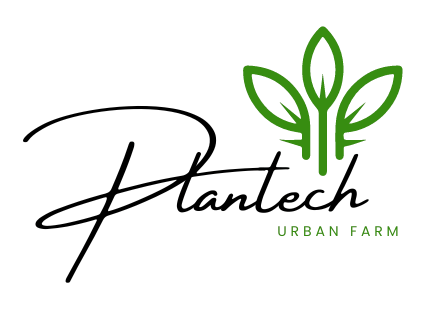

  

  A <strong>Plantech</strong> é uma fazenda urbana vertical ficticia produtora de hortaliças orgânicas, que utiliza tecnologia e inovação em uma ocupação diferente, próxima dos pontos de venda. Ela opera no modelo de negócio <strong>business-to-business (B2B)</strong>, isto é, concentrando suas atividades e fornecimento dos produtos agrícolas para outras empresas. O escoamento da produção se dá através das redes de varejo alimentar, comércios e restaurantes do bairro, valorizando assim parcerias com empresas locais que compartilham os mesmos ideais de sustentabilidade e responsabilidade social. A missão da Plantech não é apenas fornecer alimentos frescos e saudáveis, mas também oferecer benefícios ambientais e sociais para a comunidade.

<h3> Trabalho de Conclusao - Universidade Paulista UNIP </h3>

  ELLEN KAUANE DE OLIVEIRA DA SILVA  
  DORCAS CHAGAS PEREIRA  
  GIOVANA CAIRES MOTTA  
  JOÃO CARLOS TOMÁS BUENO  
  MURILO ANTONIO MIGLIATI  
  RAFAEL HENRIQUE THOMAZ

##

Plantech é um sistema de gerenciamento de fazendas urbanas, desenvolvido para facilitar o controle e organização das atividades agrícolas em um ambiente urbano. O sistema é dividido em quatro camadas de usuário: administrador, comprador, agricultor e vendedor, permitindo que cada camada realize operações de CRUD (Create, Read, Update, Delete) para gerenciar tudo o que entra e sai da fazenda.

## Tecnologias Utilizadas

## Funcionalidades

- **Cadastro e Listagem de Produtos:** Permite que cada usuário (administrador, comprador, agricultor e vendedor) cadastre novos produtos e visualize a lista de produtos cadastrados.
- **Gerenciamento de Estoque:** Controle completo do estoque de produtos, incluindo adição, atualização e remoção de itens.
- **Relatórios:** Geração de relatórios detalhados sobre a entrada e saída de produtos na fazenda.
- **Autenticação e Autorização:** Sistema de login para garantir que apenas usuários autorizados acessem certas funcionalidades.

